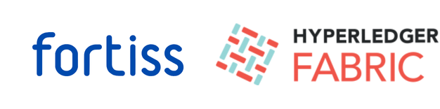

# Introduction
In order to recycle residual products, it is often necessary to know where the materials originally came from and how they were processed. Conventional methods lack in transparency and consistency, as the participants of the supply chain come from different organizations. 

This project presents a blockchain solution that connects various, independent marketplaces along the supply chain of biobased residuals. The distributed ledgers keep track of product information, certificates, and the upstream product history. We present a proof-of-concept architecture for the exemplary bio-based product trading platform, discuss potential benefits for companies and end customers and analyze current limitations of the approach.

# Hyperledger Fabric
For a supply chain, it is crucial that product entries are reliable in their authenticity and cannot be changed afterwards as a means of counterfeiting. Achieving this requirement in a distributed system with many different network participants that do not necessarily trust each other is especially challenging. Blockchain solves this problem by having an immutable ledger, which is synced among all participants.

Only entries are added that passed the consensus of the network members. This ensures that only entries are added that were accepted by the majority of the network members and removes the need for a third party acting as central authority that has to be trusted. The ledger is at all times verifiable for its correctness by the peers.

## Architecture of the blockchain system

## Network diagram of the Fabric in a sample scenario

# Setup and folder structure
- `/client`: The chemiLedger frontend component. This folder does not contain any novel code contributions but was only used for testing.
- `/server`: The chemiLedger backend server.
    - `/server/src/fabric`: This subfolder takes care of user enrollment and identity management.
    - `/server/src/routes/fabric.js`: This file provides a exemplary API that shows how to call the chaincode.
- `/database`: A MongoDB database connected to the chemiLedger backend server. It stores users and an encrypted version of the identities.
- `/product-history`: This seperate service consists of a frontend and a backend component and provides the possibility for end users to see a visual representation of the product history.
    - `/product-history/client`: The Angular client service that displays the product history. Scanned QR codes would redirect users to this page.
    - `/product-history/backend`: The express backend server that queries the chaincode to retrieve the product history.

Please refer to the respective folders to get more information.