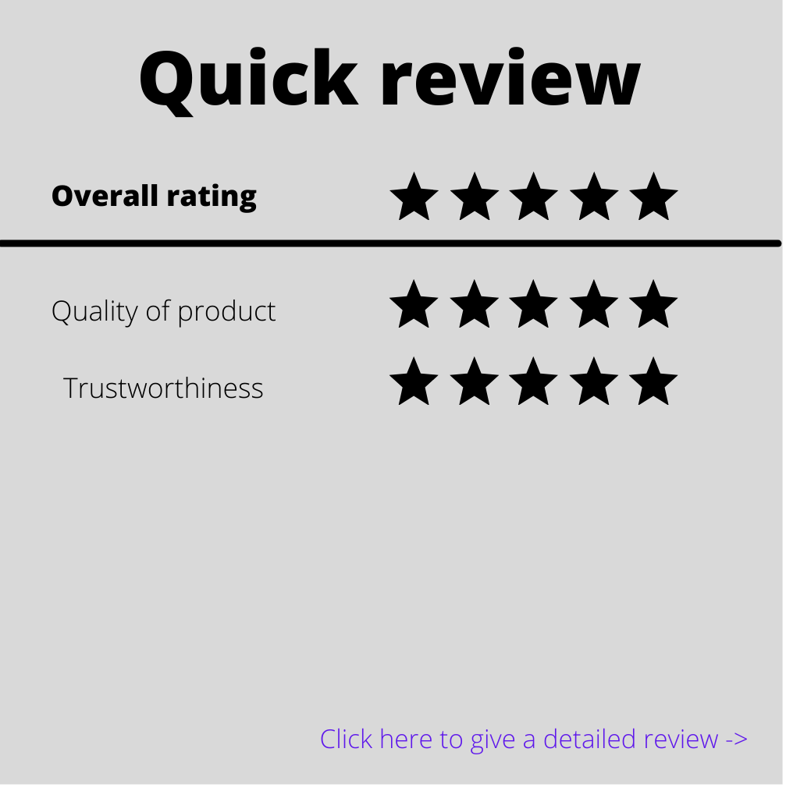

# Issues-Responses
- **How do we display reputation?**
  
  The reputation system is divided into a quick review system and a detailed review system. 

  - Quick review:
    
    

    The buyer rates the overall experience with the seller on a scale of 5. On the same screen he also gets to choose other characteristics of the seller such as trustworthiness, quality of product etc.

  - Detailed review:

    

    The buyer gets to write a review on his experience with the seller. 
