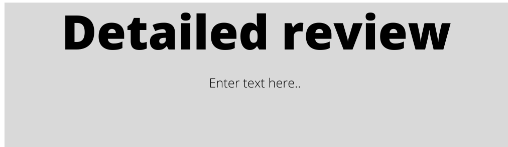

# Issues-Responses
- **How do we display reputation?**
  
  The reputation system is divided into a quick review system and a detailed review system. 

  - Quick review:
    
    

    The buyer rates the overall experience with the seller on a scale of 5. On the same screen he also gets to choose other characteristics of the seller such as trustworthiness, quality of product etc.

  - Detailed review:

    

    The buyer gets to write a review on his experience with the seller. 

- **What actions increase/decrease reputation?**

  A favourable/unfavourable review from the buyer.

- **How do we aggregate actions?**
  - Higher weights for recent actions
  - High reputation user votes count more

- **How do we encourage rating others?**
  - Current proposal:

    The users who rate other regularly get a badge reading "Active contributor" in their profile for everybody to see.
