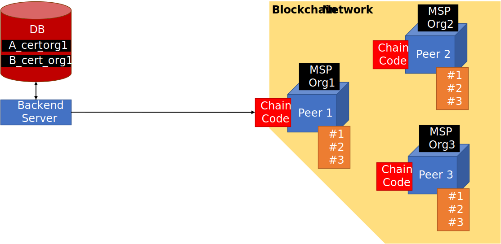
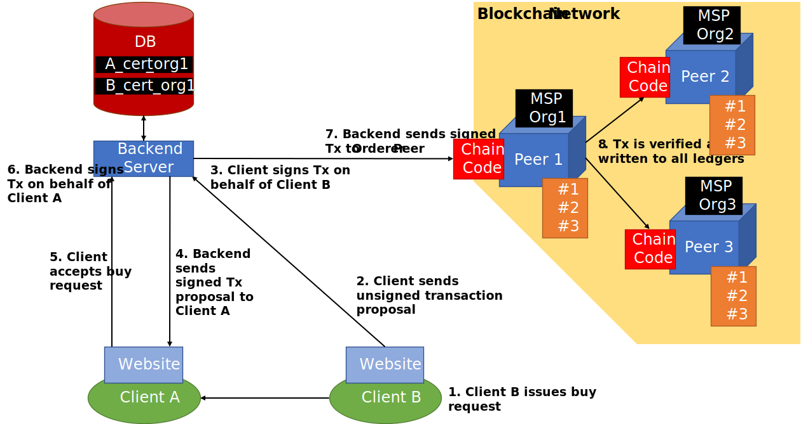
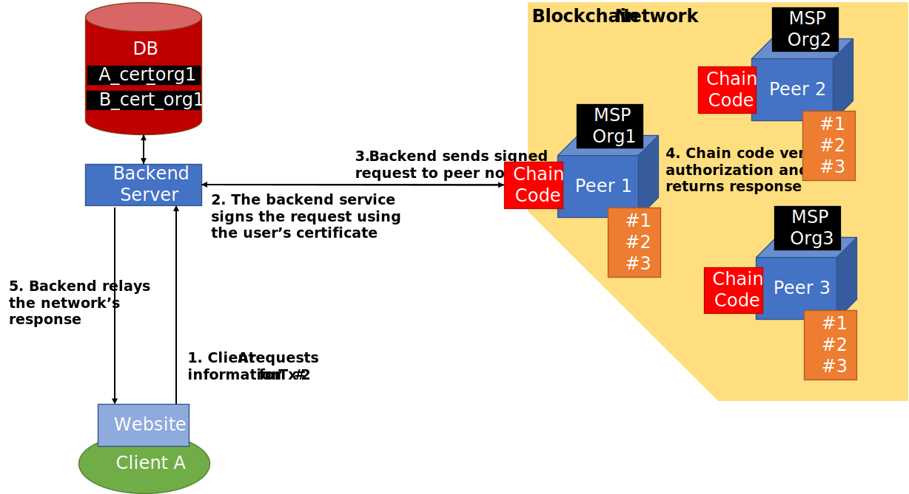

# Architecture
This section discribes the proposed backend network architecture.

## 1. Overview

The backend consists of multiple entities. We require at least one managing organization `Org1` that owns the Rohstoffbörse and hosts the backend server. Org1 is responsible for developing and maintaining the platform, as well as managing the blockchain network. The organization also runs a secured database that stores private user data.
For every new user of the Rohstoffbörse, Org1 issues a `X.509` certificate that can later be used to interact with the blockchain. The certificate is stored in the database and is only queried by the backend server to authorize API calls to the blockchain network.

The other members of the network are trusted organizations who run their own peer nodes to store a copy of the ledger. Each of these peers is secured so that it is only accessible via chain code API calls. Since the network only consists of trusted nodes, we call it a **permissioned blockchain**. This enables us to dispense with Proof of Work (POW), leading to a more efficent processing of transactions.

## 2. Transaction Flow

The image above shows an example transaction (Tx) where `Client B` buys a resource from `Client A`. We assume that both clients have an account and are logged in. `Client A` has published an advert offering a resource. `Client B` now reacts to that offer and issues a buy request. The unsigned request from `Client B` is sent to the server. The backend will use `client B's` private key to sign the Tx on its behalf. The proposal is then sent to `Client A`, who can verify the `client B's` signature. At this point, `Client A` can either reject or accept the offer. If `Client A` accepts, the backend will sign the Tx on behalf of `Client A` and transmit the now valid Tx to the orderer node of the blockchain network. The Tx is verified, in accordance with the endorsement policy, and then sent to all other peer nodes. Note that all peers hold the same copy of the ledger.

## 3. Blockchain Queries

As stated before, we assume that the peer nodes shield the ledger from any external access and only permit interaction via the chain code API. This allows us to store private transaction data on chain.
Let us consider an example, where Client A wants to query information about a transaction #2. The request will be signed using the users individual certificate and transmitted to one of the peers. Now the chain code will check wether the user is authorized to query the information. If the user was part of the transaction, he will have unlimited access. If he was not part of it, the chain code will return a partial view of the Tx that has been made public.

## 4. Benefits of the DLT
The distributed storage of transaction data results in the following properties:
Since the potentially sensitve transaction data is distributed among multiple peers, hosted by multiple organizations, there is a higher risk of data leaks. We argue that this this weakness is not as severe as it might seem, since the data always would need to be stored across multiple nodes to ensure fault tolerance and the private data only contains transaction metadata, not actual financial records or even banking information. And while read access is made somewhat easier, tampering with the data is made much harder, since an attacker would need to hack all peer nodes of a network to change information. A permissioned inside attack via one of the organizations is also impossible, since all the other organizations need to confirm a change.

Restricting the access of the ledger to the chain code API also enables us to control analytical querys in a fine grained manner. For instance, we could allow authorized admin identities of an organization to request statistics to the platform that are unavailable to normal users. This gives an additional incentive to an organization to participate in the blockchain network, since only then it would be privy to the insights of the marketplace.

We want to point out here, that the entire architecture and chain code implementation should be made open source, so that users can trust the system and check how their information is used and by whom.
